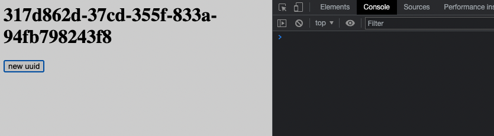

# Module Federation shared deep dependency issue

https://github.com/module-federation/module-federation-examples/issues/2033

This repo tries to reproduce the problem when sharing a dependency that exists in multiple versions across the node modules but resolves the request incorrectly.

In this example, I use `uuid`.
```
└─┬ @startup-code/app1@0.0.0 -> ./app1
  ├─┬ lib@1.0.0 -> ./lib
  │ └── uuid@3.4.0
  ├── uuid@8.3.2
  └─┬ webpack-dev-server@4.8.1
    └─┬ sockjs@0.3.24
      └── uuid@8.3.2 deduped
```

This graph shows that the root `uuid` is 8.3.2 and the version under `lib` is 3.4.0.

`lib` uses the `v3` method from `uuid`.
This method exists only in version 8.3.2.

By default, if we build this project, serve it and click on `new uuid`, **everything crashes as expected**:


But when we use Module Federation and share this package from `app1` like this:
```js
[
      new ModuleFederationPlugin({
      name: 'app1',
      shared: {
        lib: deps['lib'],
        uuid: deps['uuid'], // <-- resolve to ^8.3.2
        react: { singleton: true, requiredVersion: deps.react },
        'react-dom': { singleton: true, requiredVersion: deps['react-dom'] },
      },
    })
]
```

We can see that the runtime understands the difference between the packages:


But when we click on `new uuid` which crashed our app, it works (not the desired behavior)...


When we look inside the index file, we can see the `moduleToHandlerMapping` resolve it incorrectly:


And when we remove the `uuid` entry from the `shared` section in ModuleFederationPlugin we can see that the app behaves as expected:


For some reason, even when it is explicitly defined to be shared with `^8.3.2`, it matches the `3.4.0` version that `lib` consumes.
